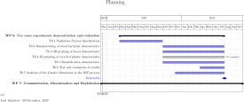
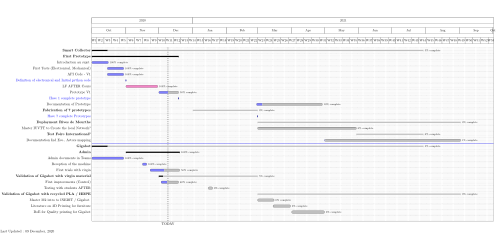

```{r share-again, echo=FALSE}
xaringanExtra::use_share_again()
```

# Global Planning WP6

```{r echo=FALSE, out.height=450, out.width= 2000}

```


---
# Goals of the WP

- Implement the consumer-driven DIT process within the four use cases
- Validate the INEDIT process specifications
- Experiment and validate the result
- Identify potential gender issues and insights to overcome them


---
## Task 6.4: 3D printing of recycled plastic demonstrator 
### [TL: UL. Participants: CROWD, TTPSC]

> The main goal of this task is to validate the .content-box-yellow[logistical and technical feasibility of recycled assets] to be used in the DIT approach. These two elements will be implemented in relevant environment in order to prove the integration of a distributed and local plastic recycling chain around OMDF. This integration will be validated according the KPI. UL will develop the recycling pilot platform based on open design approach in order to be replicable to other countries


**Delivrable 6.4:** 3D printing of recycled plastic demonstrator .content-box-yellow[Deadline. Jul 2022]


---
background-image: url("../figures/Gantt/Task6-4/Planning.svg")
background-size: contain


## Planning WP6 - Task 6.4

```{r echo=FALSE}

#library(magick)
#"../figures/Gantt/Task6-4/Planning.svg"
#Planning <- image_convert(tiger, "png")

#
```


---

# Smart Collector

.pull-left[ 
- To create a local network collection for puntual plastic material. 
]


.pull-right[ 

]


.footnote[
*Kranzinger, L., Pomberger, R., Schwabl, D., Flachberger, H., Bauer, M., Lehner, M., Hofer, W., 2018. Output-oriented analysis of the wet mechanical processing of polyolefin-rich waste for feedstock recycling. Waste Manag. Res. 36, 445–453
]


---

background-image: url("../figures/Test/SM/Diapositive4.jpeg")
background-size: contain

---

background-image: url("../figures/Test/SM/Diapositive5.jpeg")
background-size: contain

---

background-image: url("../figures/Test/SM/Diapositive6.jpeg")
background-size: contain

---

background-image: url("../figures/Test/SM/Diapositive7.jpeg")
background-size: contain

---


background-image: url("../figures/Test/SM/Diapositive8.jpeg")
background-size: contain

---

# Gigabot

.pull-left[ 
- Print big
]

---

background-image: url("../figures/Test/SM/Diapositive9.jpeg")
background-size: contain


---

# Hangprinter? 


---

class: middle, center


Thanks !


