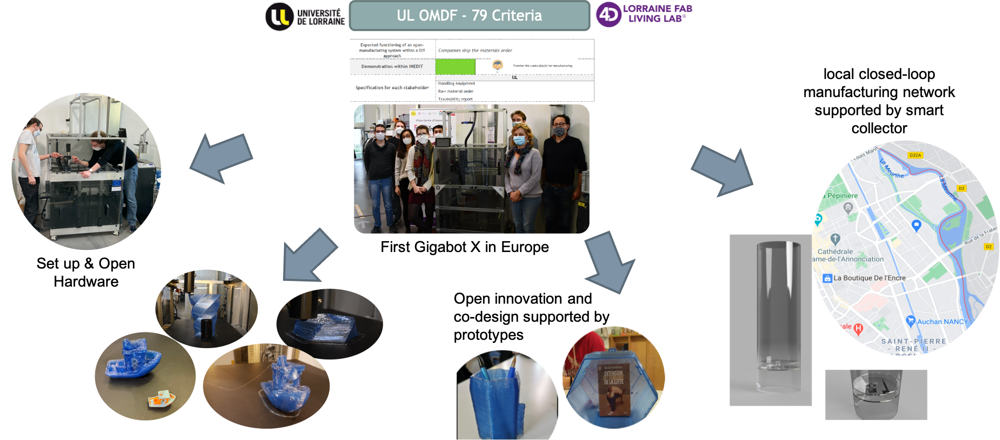

```{r packages, echo = FALSE, message=FALSE, warning=FALSE}
# Libraries
source("xaringan-themer.R")

options(htmltools.dir.version = FALSE)
knitr::opts_chunk$set(
  fig.width=9, fig.height=3.5, fig.retina=3,
  out.width = "100%",
  cache = FALSE,
  echo = FALSE,
  message = FALSE, 
  warning = FALSE,
  fig.show = TRUE,
  hiline = TRUE,
  include = TRUE
)

# Link for the Figures
URL = c('https://raw.githubusercontent.com/fabbiocrux/Figures/main/')

#library(xaringanBuilder)
#build_pdf("index.Rmd")

# xaringanExtra
xaringanExtra::use_panelset()

#xaringanExtra::use_share_again()
```


class: title-slide, left, bottom


```{r, out.width = '250px', fig.align='right'}
knitr::include_graphics(paste0(URL, 'Logos/ERPI//UL-ERPI.png'))
```


`r fa("map-marker-alt", fill = "steelblue")` `r rmarkdown::metadata$date`

# `r fa("comment", fill = "steelblue")` `r rmarkdown::metadata$title`

`r fa("user-friends", fill = "steelblue")` `r rmarkdown::metadata$subtitle`

---


```{r xaringan-logo, echo=FALSE, include=TRUE}
xaringanExtra::use_logo(
  image_url = "https://raw.githubusercontent.com/fabbiocrux/Figures/main/Inedit/background.svg",
  width = "100%",
  height = "100%",
  position = css_position(top = "0em", right = "0em"),
)

```


# Goals the WP-6

.pull-left-2[
- Implement the consumer-driven DIT process within the four use cases
- Validate the INEDIT process specifications
- Experiment and validate the result
- Identify potential gender issues and insights to overcome them

## Task 6.4: 3D printing of recycled plastic demonstrator 

**TL: UL. Participants: CROWD, TTPSC**


> The main goal of this task is to validate the .bg-green[logistical and technical feasibility of recycled assets] to be used in the DIT approach. These two elements will be implemented in relevant environment in order to prove the integration of a distributed and local plastic recycling chain around OMDF. This integration will be validated according the KPI. UL will develop the recycling pilot platform based on open design approach in order to be replicable to other countries


**Delivrable 6.4:** 3D printing of recycled plastic demonstrator .bg-yellow[Deadline. Jul 2022]

]
.pull-right-1[

```{r, out.width = '90%', fig.align='center'}
knitr::include_graphics(paste0(URL, 'Gigabot/Gigabot-05.jpg'))
```
]


---

# Planning Task 6.4:


```{r, fig.align='center'}

#Planning <- image_convert(tiger, "png")
magick::image_read_pdf("figures/Gantt/WP6/Planning.pdf",
                       pages = 1)
```

---
class: middle

# Agenda for Meeting  `r format(Sys.time(), '%d %B, %Y')`

.grey_Inedit[
1. .large.blue[**Coordination and alignement with WP 4.3-4.4**]
1. .large.blue[**Literature and Background on Additive manufacturing / Recycling / Sustainability**]
1. Printability test on Virgin material for calibration purposes
1. Iterative technical improvement of printing process
1. Definition of the scope of plastic wastes according printability 
1. Experimental research design to test quality on virgin and recycled objects
1. .large.blue[**Technical development of smart collector to collect plastic waste**]
1. Validation and consolidation of network of the local actors
1. Validation Demonstrator for INEDIT stakeholders (according KPI's?)
      ]   


---
class:  middle center inverse

# .Large[1) Coordination and alignement with WP 4.3-4.4 ]

---

## Coordination and alignement with WP 4.3-4.4 tasks

UL OMDF (communities, Co-design, Gigabot X & more) : T4.3, T4.4  & WP6 


```{r, out.width = '90%', fig.align='center'}

```

---

## Others connectionds...

---

class:  middle center inverse

# .Large[2) Literature and Background on Additive manufacturing / Recycling / Sustainability ]

---


# .Large[2) Technical development of smart collector to collect plastic waste


---

# Smart Collector

.pull-left[ 
- To create a local network collection for puntual plastic material. 
]


.pull-right[ 
ss
]


.footnote[
*Kranzinger, L., Pomberger, R., Schwabl, D., Flachberger, H., Bauer, M., Lehner, M., Hofer, W., 2018. Output-oriented analysis of the wet mechanical processing of polyolefin-rich waste for feedstock recycling. Waste Manag. Res. 36, 445–453
]


---

Technical development of smart collector to collect plastic waste

---

# Gigabot

.pull-left[ 
- Print big
]

---


# Hangprinter? 


---

class: middle, center


Thanks !


